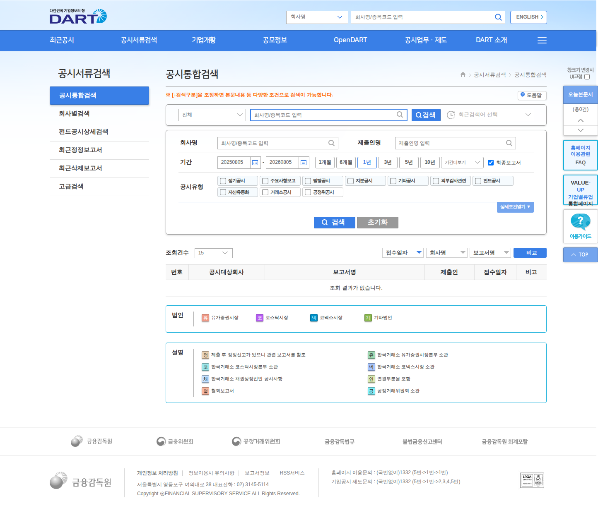
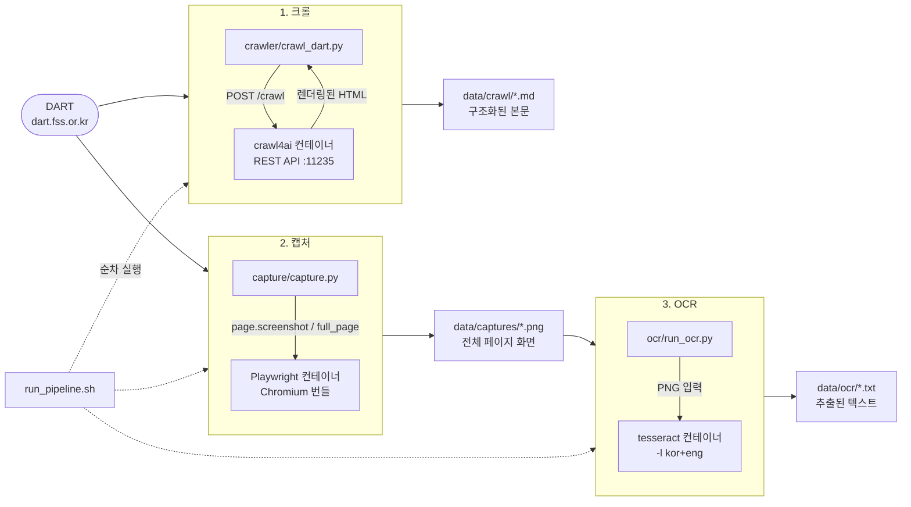

# dartcatcher

**크롤 → 캡처 → OCR.** 금융감독원 전자공시시스템(DART)의 공개 공시를 세 가지 방식으로
수집하는 파이프라인. 세 단계 모두 기성 Docker 이미지를 조합했고 호스트에는 아무 런타임도
설치하지 않는다.

<sub>A three-stage financial-disclosure collection pipeline (crawl, screenshot, OCR), assembled entirely from off-the-shelf Docker images.</sub>

[](LICENSE)
[](docker-compose.yml)
[](#빠른-시작)
[](crawler/README.md)
[](capture/README.md)
[](ocr/README.md)

<p align="center">
  
</p>

<p align="center">
  <sub>2단계 산출물인 DART 공시통합검색 전체 페이지 캡처(1444×1252). 3단계 OCR 정확도도 이 화면을 기준으로 측정했다.</sub>
</p>

## 결과 한눈에

| 단계 | 실측 결과 | 근거 |
| --- | --- | --- |
| 1. 크롤 | 공시 목록 3페이지에서 접수번호 기준 **45건**, 페이지 간 중복 0, 전부 HTTP 200 | [`data/crawl/dart_summary.json`](data/crawl/dart_summary.json) · [`evidence/crawl_run.txt`](evidence/crawl_run.txt) |
| 2. 캡처 | 전체 페이지 PNG **1444×2469 / 1444×1252**, 폰트 추가 설치 없이 한글 정상 렌더링 | [`data/captures/`](data/captures/) |
| 3. OCR | 한국어 정확 일치 **61.3%** (38/62) · 영어 인용문 **10/10**, 저자명 **8/8** | [`evidence/ocr_quality.txt`](evidence/ocr_quality.txt) |
| 개선 실험 | 캡처 해상도 2배(`device_scale_factor=2`)로 재측정 시 **61.3% → 83.9%**. 1페이지 1회 측정이라 일반화는 **미검증** | [`evidence/ocr_quality_hidpi_experiment.txt`](evidence/ocr_quality_hidpi_experiment.txt) |
| 실행 | 3단계 순차 실행 **1분 58초 ~ 5분 2초** (이미지를 이미 받아둔 상태. OCR이 누적된 PNG를 전부 다시 처리해 실행마다 달라진다) | [`evidence/pipeline_run.txt`](evidence/pipeline_run.txt) |

문서의 모든 수치는 2026-08-05 (KST) macOS arm64 / Docker 29.6.2 환경에서 실제로 실행한
결과이며 출력 원문은 [`evidence/`](evidence/) 에 그대로 남겨두었다.

## 목차

- [개요](#개요)
- [아키텍처](#아키텍처)
- [빠른 시작](#빠른-시작)
- [결과](#결과)
- [각 단계 동작](#각-단계-동작)
- [품질과 한계](#품질과-한계)
- [크롤링 윤리](#크롤링-윤리)
- [공식 API 대안](#공식-api-대안)
- [로드맵](#로드맵)
- [저장소 구조](#저장소-구조)
- [라이선스](#라이선스)

## 개요

수집 계층을 직접 만들면 헤드리스 브라우저 설치, 브라우저·드라이버 버전 정합, 리눅스 폰트와
그래픽 의존성, OCR 엔진 빌드까지 전부 떠안게 된다. 그 중 어느 것도 이 프로젝트가 풀려는
문제가 아니다. 그래서 **각 단계에서 이미 잘 만들어진 이미지를 가져다 쓰고 그 이미지들이
채워주지 않는 틈만 코드로 메우는** 방식을 택했다.

직접 쓴 코드는 각 이미지를 호출하는 얇은 실행 스크립트와, 이미지가 막아서거나 빠뜨린 부분을
메우는 우회로 세 개다. crawl4ai가 `js_code` 를 금지해 돌아가야 했던 목록 엔드포인트 직접
호출, Playwright 이미지에 pip 패키지가 빠져 있어 붙인 설치 한 줄, tesseract 이미지에 한국어
모델이 없어 만든 학습 데이터 주입 경로다.

조합의 이점은 컨테이너를 지우면 흔적이 남지 않는다는 것이고, 비용은 이미지가 안 해주는 일을
만났을 때 우회로를 직접 찾아야 한다는 것이다. 이 문서는 그 우회로를 성공 사례와 함께
**실패 기록으로도** 남긴다.

## 아키텍처



크롤과 캡처는 같은 사이트를 서로 다른 방식으로 본다. 크롤은 **문서의 구조**(표, 링크,
접수번호)를 얻고 캡처는 **사람이 보는 화면 그대로**를 남긴다. OCR은 그 화면을 다시
텍스트로 되돌려, 구조화된 수집 경로가 닿지 못하는 표면(이미지로 그려진 표, 스캔 문서)에
대비한 경로를 만든다.

## 빠른 시작

### 사전 요구사항

- **Docker**: 실행 중일 것. 검증 환경 29.6.2
- **bash**, **curl**, **openssl**: macOS/리눅스 기본 포함
- **python3**: 표준 라이브러리만 사용하므로 `pip install` 불필요. 검증 환경 3.13
- 디스크 여유 **약 14GB** (이미지 3종 합계) + 학습 데이터 약 27MB
- 네트워크: 최초 실행 시 이미지를 받는다(합계 수 분 소요)

### 실행

```bash
git clone https://github.com/Noah-TaeHwan/dartcatcher.git
cd dartcatcher
bash run_pipeline.sh
```

이 한 줄이 하는 일:

1. crawl4ai API 토큰이 없으면 만들어 `.env` 에 넣는다(`.gitignore` 대상).
2. crawl4ai 컨테이너를 띄우고 `/health` 가 응답할 때까지 기다린 뒤 공시 목록 3페이지를 수집.
3. Playwright 컨테이너로 같은 사이트 2페이지를 전체 페이지 스크린샷으로 저장.
4. 한국어 학습 데이터를 (없으면) 받아 tesseract 컨테이너로 PNG에서 텍스트 추출.

옵션:

```bash
bash run_pipeline.sh --skip-crawl     # 이미 수집한 결과가 있을 때 2·3단계만
bash run_pipeline.sh --stop-crawler   # 끝나고 crawl4ai 컨테이너까지 정리
```

<details>
<summary><b>실제 실행 출력 펼쳐보기</b> (전체는 <code>evidence/pipeline_run.txt</code>)</summary>

```
════════════════════════════════════════════
  1/3  크롤  (unclecode/crawl4ai:latest)
════════════════════════════════════════════
[기동] crawl4ai-pipeline (포트 11235)
[확인] crawl4ai 응답 정상 ({"status":"ok","timestamp":1785893079.255975,"version":"0.9.2"})
[ok] 1페이지 status=200 공시건수=15 md=4812자
[ok] 2페이지 status=200 공시건수=15 md=5092자
[ok] 3페이지 status=200 공시건수=15 md=5009자

════════════════════════════════════════════
  2/3  캡처  (mcr.microsoft.com/playwright/python:v1.62.0-noble)
════════════════════════════════════════════
[성공] dart-main: HTTP 200 / title='전자공시시스템' / ...dart-main.png (407,784 bytes)
[성공] dart-search: HTTP 200 / title='전자공시시스템| 공시서류검색 | 공시통합검색' / ...

════════════════════════════════════════════
  3/3  OCR  (jitesoft/tesseract-ocr:5.5.2)
════════════════════════════════════════════
[ok  ] data/ocr/...dart-main.txt 4128자 / 한글 898자 / 53줄 / 59.41초
[ok  ] data/ocr/...dart-search.txt 1695자 / 한글 437자 / 47줄 / 22.43초

════════════════════════════════════════════
  완료
════════════════════════════════════════════
산출물:
  크롤 : 3개 마크다운  (data/crawl/)
  캡처 : 7개 PNG        (data/captures/)
  OCR  : 7개 텍스트     (data/ocr/)
```

3단계 전체 **5분 2초** (이미지를 이미 받아둔 상태, `time bash run_pipeline.sh --stop-crawler`
실측). 앞선 실행에서는 같은 3단계가 **1분 58초** 였는데, 차이는 거의 전부 OCR 단계에서
나온다. OCR은 `data/captures/` 에 쌓인 **모든** PNG를 다시 처리하므로 실행을 반복할수록
느려진다(위 실행은 7장). 재실행 시 산출물이 쌓이는 문제는 [품질과 한계](#품질과-한계) 절에
적어두었다.

위 로그의 PNG·텍스트 개수(7개)는 그 시점에 누적돼 있던 파일 수다. 저장소에는 기준 실행과
최종 검증 실행만 남겨 정리했으므로 현재는 5개씩 들어 있다.

</details>

### Docker Compose로 돌리기

같은 파이프라인을 [`docker-compose.yml`](docker-compose.yml) 로도 정의해두었다.

```bash
docker compose --profile pipeline run --rm ocr
docker compose --profile pipeline down
```

`.env` 의 API 토큰은 compose가 알아서 읽는다(셸에 따로 주입할 필요 없음).
`.env` 가 아직 없다면 `run_pipeline.sh` 를 한 번 돌리거나 직접 만든다:

```bash
printf 'CRAWL4AI_API_TOKEN=%s\n' "$(openssl rand -hex 32)" > .env && chmod 600 .env
```

`up` 이 아니라 마지막 잡을 `run` 하는 것이 핵심이다. `depends_on` 사슬을 거슬러 올라가
`crawl4ai(healthy) → crawl(정상종료) → capture(정상종료) → ocr` 순으로 실행된다.
실제 로그로 이 순서를 확인했다([`evidence/compose_run.txt`](evidence/compose_run.txt)).

<details>
<summary><b>compose와 스크립트, 왜 둘 다 있나</b></summary>

compose는 **의존성과 실행 순서를 선언**하는 데 뛰어나고 실제로 4단계 사슬 전체를
compose만으로 돌리는 데 성공했다. 다만 스크립트를 없애지는 않았다. 이유는 셋이다.

1. **`up` 으로는 이 사슬이 안 돈다.** 처음에는 `up --exit-code-from ocr` 로 만들었는데,
   이 옵션은 `--abort-on-container-exit` 를 켜서 *아무 컨테이너나 하나 끝나면* 전체를
   정지시킨다. 원샷 잡인 `crawl` 이 정상 종료(0)하는 순간 스택이 내려가 `capture` 가
   SIGKILL(137)로 죽고 `ocr` 은 실행조차 되지 않는데, **종료 코드는 `ocr` 기준이라 0이
   나와 성공처럼 보였다.** 실측 기록은
   [`evidence/compose_up_exitcode_trap.txt`](evidence/compose_up_exitcode_trap.txt) 에 있다.
   `run` 으로 바꿔 해결했지만 이런 함정이 있는 만큼 검증된 실행 경로를 하나 더 두는 편이
   안전하다고 판단했다.
2. **선행 조건과 조건부 분기는 compose가 표현하지 못한다.** 토큰이 없으면 만들고, 학습
   데이터가 없으면 받고, 컨테이너가 이미 떠 있으면 재사용하는 흐름은 셸 쪽이 자연스럽다.
   compose의 OCR 잡은 학습 데이터가 없으면 "먼저 `fetch_tessdata.sh` 를 돌려라"라고 안내하고
   멈추는 수준에 그친다.
3. **로그를 읽기 쉽다.** compose는 4개 컨테이너 로그를 접두사와 함께 섞어 출력한다.
   스크립트는 단계별로 구분선을 찍어 순서대로 보여준다.

억지로 한쪽에 몰아넣지 않고 compose는 "이 파이프라인이 어떤 서비스로 구성되는가"의
선언으로, 스크립트는 "한 번 제대로 돌리는" 실행 경로로 쓴다.

</details>

## 결과

### 1단계 크롤 (`data/crawl/dart_page1.md`)

crawl4ai가 렌더링한 공시 목록을 마크다운 표로 변환한 결과. 접수번호(`rcpNo`)와
기업 고유번호가 링크에 그대로 살아 있어 후속 처리에 쓸 수 있다.

```markdown
공시서류검색 목록
| 번호 | 공시대상회사 | 보고서명 | 제출인 | 접수일자 | 비고 |
| --- | --- | --- | --- | --- | --- |
| 1 | 코 [디바이스](...) | [임원ㆍ주요주주특정증권등소유상황보고서](https://dart.fss.or.kr/dsaf001/main.do?rcpNo=20260805000118) | 이상종 | 2026.08.05 | |
| 2 | 코 [셀리드](...) | [소송등의판결ㆍ결정(일정금액이상의청구)](https://dart.fss.or.kr/dsaf001/main.do?rcpNo=20260805900182) | 셀리드 | 2026.08.05 | 코 |
| 3 | 기 [농협유통](...) | [지급수단별ㆍ지급기간별지급금액및분쟁조정기구에관한사항](https://dart.fss.or.kr/dsaf001/main.do?rcpNo=20260805000117) | 농협유통 | 2026.08.05 | 공 |
```

(기업개황 링크의 긴 `javascript:` URL은 발췌에서 `(...)` 로 줄였다. 원본은
`data/crawl/dart_page1.md` 에 그대로 있다.)

메타데이터(`data/crawl/dart_page1.json`):

```json
{
  "page": 1,
  "http_status": 200,
  "markdown_chars": 4812,
  "receipt_no_count": 15,
  "receipt_no_sample": ["20260805000100", "20260805000101", "20260805000103"],
  "request_interval_sec": 2.5
}
```

### 2단계 캡처 (`data/captures/*.png`)

| 파일 | 해상도 | 크기 |
| --- | --- | --- |
| `20260805T003628Z_dart-main.png` | 1444×2469 | 410,541 B |
| `20260805T003628Z_dart-search.png` | 1444×1252 | 226,410 B |

뷰포트 높이(900)를 넘는 푸터까지 포함된 전체 페이지가 잡혔고 이미지에 포함된 폰트만으로
한글이 깨짐 없이 렌더링됐다(별도 폰트 설치 없음).

### 3단계 OCR (`data/ocr/20260805T003628Z_dart-search.txt`)

아래는 원문 그대로의 발췌다(줄 번호는 파일 기준, 긴 공백은 유지).

```
27| ※ [:검색구분]을 조정하면 본문내용 등 다양한 조건으로 검색이 가능합니다.        # 도움말
28| 전체         ~ | | 회사명/증목코드 입력          Q  (쏘 최근검색어 선택      ~
29| 획사명    회사명/종목코드 입력       Q     제출인명   제출인명 입력       Q
35| 번호     공시대상회사        보고서명        제출인    접수일자   비고
36| 조회 결과가 없습니다.
43| 개인정보 처리방침 ㅣ 정보이용시 유의사항 ㅣ 보고서정보 ㅣ 055서비스
44| 서물특별시 영등포구 여의대로 38 대표전화 : 02) 3145.5114
```

발췌만 봐도 성격이 보인다. `조회 결과가 없습니다`, `개인정보 처리방침`,
`※ [:검색구분]을 조정하면 본문내용 등 다양한 조건으로 검색이 가능합니다` 같은
**문장은 거의 그대로 읽히고** 짧은 UI 조각은 자주 깨진다. `회사명 → 획사명`(29행),
`RSS서비스 → 055서비스`(43행), `서울특별시 → 서물특별시`(44행)이 그렇다.

특히 28행과 29행을 나란히 보면 이 단계의 불안정함이 드러난다. **같은 화면 안의 같은
`회사명/종목코드 입력` 문구인데 28행에서는 `증목코드` 로 깨지고 29행에서는 `종목코드` 로
정확히 읽혔다.** 두 곳은 입력창 테두리 스타일과 배경만 다를 뿐 글자는 같다. 즉 결과가
글자 자체보다 주변 렌더링에 흔들린다는 뜻이라, **같은 문자열이라도 위치에 따라 결과가
달라질 수 있다고 보고 써야 한다.** 무엇이 이 차이를 만드는지는 아직 규명하지 못했다.

정량 평가는 [품질과 한계](#품질과-한계) 절과 [`ocr/README.md`](ocr/README.md) 참고.

## 각 단계 동작

세 단계 모두 **얇은 파이썬 스크립트 + 기성 이미지** 조합이다. 각 단계에서 왜 그 이미지를
골랐는지, 실행 중 무엇이 막혔고 어떻게 우회했는지는 하위 문서에 전부 적어두었다.

| 단계 | 이미지 | 하는 일 | 실행 중 막혔던 지점과 우회 | 상세 |
| --- | --- | --- | --- | --- |
| 1. 크롤 | `unclecode/crawl4ai:latest` | 헤드리스 브라우저로 목록 페이지를 렌더링해 마크다운으로 변환하는 REST API 서버 | 목록이 AJAX로 채워져 `main.do` 로는 빈 표만 온다. 브라우저에서 `search()` 를 호출하려 했으나 crawl4ai 0.9.2가 신뢰되지 않은 요청의 `js_code` 를 금지 → 화면이 내부적으로 쓰는 목록 엔드포인트 `dsab007/detailSearch.ax` 를 직접 열어 우회 | [`crawler/README.md`](crawler/README.md) |
| 2. 캡처 | `mcr.microsoft.com/playwright/python:v1.62.0-noble` | `page.screenshot(full_page=True)` 로 뷰포트 밖까지 포함한 전체 페이지 PNG 저장 | 이미지에 브라우저 바이너리는 있지만 `playwright` pip 패키지가 없다 → 실행 시 `pip install playwright==1.62.0` 한 줄을 붙임. `PLAYWRIGHT_BROWSERS_PATH` 가 이미 잡혀 있어 브라우저 다운로드는 불필요 | [`capture/README.md`](capture/README.md) |
| 3. OCR | `jitesoft/tesseract-ocr:5.5.2` | PNG를 `-l kor+eng` 로 처리해 텍스트 추출 | 이미지 내장 언어가 `eng/equ/osd` 뿐이라 한국어가 없다 → `tessdata_best` 에서 `kor`·`eng` 를 받아 `TESSDATA_PREFIX` 를 마운트 경로로 덮어써 주입 | [`ocr/README.md`](ocr/README.md) |

### 이미지 선택 근거 요약

- **crawl4ai**: JS 렌더링과 본문 추출·마크다운 변환을 한 이미지에서 끝내고 REST 서버 모드를
  기본 제공해 수집 계층을 언어 중립적으로 분리할 수 있다. Splash는 출력이 HTML/PNG 수준이라
  본문 추출을 따로 붙여야 했다.
- **Playwright(공식)**: 배포사가 직접 유지보수하고 릴리스마다 같은 버전 태그가 올라와
  런타임/라이브러리 버전을 고정할 수 있다. Chromium·폰트·그래픽 의존성이 번들돼 `apt-get`
  단계가 통째로 사라진다. Selenium은 드라이버·브라우저 버전을 따로 맞춰야 한다.
- **tesseract(서드파티)**: tesseract는 공식 이미지를 내지 않아 서드파티 중에서 골랐다.
  5.x LSTM 엔진 최신 계열을 따라가고 패치 단위 태그(`5.5.2`)로 고정 가능하며 arm64/amd64
  멀티아치라 애플 실리콘에서 에뮬레이션 없이 돈다.

### 이미지 크기

측정 환경: Docker 29.6.2, macOS arm64. `docker images` 와 `docker image inspect` 가 서로 다른
값을 보고하는데, 어느 쪽이 디스크 실사용량인지는 확인하지 못해 둘 다 적는다.

| 이미지 | `docker images` | `inspect .Size` |
| --- | --- | --- |
| crawl4ai | 9.06GB | 약 2.2GB |
| playwright/python | 3.77GB | 미측정 |
| tesseract-ocr | 387MB | 약 123MB |

## 품질과 한계

정직하게 적는다.

**OCR 한국어 정확도가 61.3% 다.** 캡처 PNG를 직접 눈으로 읽어 만든 정답지 62건과 대조한
수치다(`python3 ocr/eval_quality.py`). 문장형 본문은 잘 읽히지만 짧은 UI 라벨, 색 배지 위
글자, 체크박스 옆 텍스트는 자주 깨진다. **현재 품질로는 하류 분석에 그대로 넣을 수 없고,
사람이 확인하는 보조 자료 수준이다.** 같은 정답지로 영어(`quotes.toscrape.com`)를 재면
인용문 10/10, 저자명 8/8 완전 일치라, 한국어 특유의 문제로 보인다.

**원인은 캡처 해상도로 보인다.** tesseract가 입력 해상도를 153 DPI로 추정했는데(권장 300),
같은 페이지를 `device_scale_factor=2` 로 다시 캡처해 재측정하니 **61.3% → 83.9%** 로
올랐다. 다만 한 페이지 1회 측정이라 일반화는 **미검증**이다.

**대상이 DART 두세 페이지에 고정돼 있다.** URL이 코드에 상수로 박혀 있어 다른 사이트를
넣으려면 코드를 고쳐야 한다.

**robots.txt를 자동으로 지키지 않는다.** 사람이 한 번 읽고 판단한 결과를 코드에 반영한
방식이라, 대상이 늘거나 robots.txt가 바뀌면 사람이 다시 확인해야 한다.

**crawl4ai 이미지만 버전 태그가 없다.** 다른 둘은 `v1.62.0-noble`, `5.5.2` 로 고정했지만
crawl4ai는 `latest` 밖에 없어 이미지가 갱신되면 동작이 달라질 수 있다. 실행 중인 버전은
0.9.2 였다.

**재실행 시 산출물이 계속 쌓인다.** 타임스탬프로 구분만 할 뿐 정리·보관 정책이 없다.

정량 평가의 전체 내역(정답지 62건, 불일치 목록, 해상도 실험)은
[`ocr/README.md`](ocr/README.md) 에 있다.

## 크롤링 윤리

수집 대상이 공개 데이터라 해도 상대 서버는 남의 인프라다. 다음 원칙을 코드와 실행에
반영했다.

### robots.txt를 먼저 받아 확인했다

```bash
$ curl https://dart.fss.or.kr/robots.txt
User-agent: *
Disallow: /dsaf001/main.do
Disallow: /report/viewer.do
Disallow: /report/download.do
Disallow: /pdf/download/
Disallow: /dsae001/selectPopup.ax
Disallow: /html/search/SearchCompany_M2.html
```

원문은 [`evidence/dart_robots.txt`](evidence/dart_robots.txt), 응답 헤더는
[`evidence/dart_robots_headers.txt`](evidence/dart_robots_headers.txt) 에 그대로 남겼다.

판단 결과:

- 수집한 경로는 `/dsab007/detailSearch.ax`(공시 목록)이며 Disallow 목록에 없다 → **허용**.
- `Disallow: /dsaf001/main.do` 는 **개별 공시 원문 뷰어**다. 목록에 그 링크가 들어 있지만
  **따라 들어가지 않았다.** 목록 페이지에서 멈춘다.
- `Disallow: /dsae001/selectPopup.ax`(기업개황 팝업)도 링크만 두고 접근하지 않았다.
- `Crawl-delay`, `Sitemap` 지시자는 없다.

### 요청 간격

- 크롤 단계: 페이지 사이 **2.5초** 대기 (`crawler/crawl_dart.py` 의 `REQUEST_INTERVAL_SEC`)
- 캡처 단계: 페이지 사이 **3.0초** 대기 (`capture/capture.py` 의 `REQUEST_INTERVAL_SEC`)
- robots.txt에 `Crawl-delay` 가 없어 자체 기준을 정해 적용했다.

### 최소 페이지 원칙

- 크롤은 **1~3페이지, 페이지당 15건**까지만. 전체 아카이브를 훑지 않는다.
- 캡처는 **2개 페이지, 각 1회씩**만 접속한다.
- **동시 요청 없음.** 전 단계가 순차 실행이며 병렬 요청을 보내지 않는다.
- 로그인·인증이 필요한 영역은 건드리지 않는다. 공개 페이지만 대상으로 한다.
- OCR 단계는 네트워크 요청이 전혀 없다. 이미 받아둔 PNG만 읽는다.

정직하게 덧붙이면, 이 파이프라인은 **robots.txt를 코드로 파싱해 자동으로 지키지 않는다.**
사람이 한 번 읽고 대상 URL을 직접 골라 넣는 방식이다. 대상이 늘어나면 자동 확인이
필요하며 로드맵에 넣어두었다.

## 공식 API 대안

**대량·정기 수집이 목적이라면 이 파이프라인이 아니라 공식 API를 써야 한다.** 화면을
긁는 방식은 상대 서버에 부담을 주고, HTML 구조가 바뀌면 조용히 깨진다. 이용약관과 충돌할
소지도 있다. 아래는 이 프로젝트의 대상 영역에서 우선 검토해야 할 공식 경로다.

### DART OPEN API, 한국 공시 데이터의 정공법

금융감독원이 직접 운영하는 공식 API(<https://opendart.fss.or.kr>)다. 인증키를 발급받아
쓴다. 공시검색·기업개황·공시서류 원본파일·고유번호 목록을 제공한다. 재무제표를 포함한
정형 데이터를 JSON/XML로 바로 받을 수 있어, 이 저장소가 마크다운으로 긁어오는 공시 목록은
사실상 이 API로 대체 가능하다. **한국 공시 데이터를 정기 수집한다면 첫 번째 선택지다.**
(일일 호출 한도 등 구체적 쿼터는 공식 가이드 첫 화면에 명시돼 있지 않아 **확인하지 못했다.**
실제 운영 전에는 인증키 발급 후 이용약관과 쿼터를 직접 확인해야 한다.)

이 주장을 문장으로만 두지 않으려고 실제로 호출해보는 모듈을 따로 뒀다.
[`api/README.md`](api/README.md) 에 정리했다. 같은 날 크롤로 얻은 접수번호 45건을
공식 API 응답과 대조하니 **45건 전부(100%) 확인**됐고, 반대로 크롤이 훑은 시간
구간 안에서 화면 목록이 빼먹은 공시가 **3건** 나왔다.

### OpenBB, 글로벌 금융 데이터를 한 인터페이스로

오픈소스 금융 데이터 플랫폼(<https://openbb.co>)으로, 주가·재무제표·거시지표·옵션 등을
여러 공급자(FMP, Intrinio, yfinance, FRED 등)에서 끌어와 **하나의 파이썬 인터페이스로
통일**해준다. 공급자를 바꿔도 호출 코드가 거의 그대로라, 데이터 소스를 갈아끼울 여지를
남기고 싶을 때 유용하다. 다만 한국 공시(DART) 커버리지는 약하므로 국내 공시는 여전히
DART OPEN API 쪽이 낫고 상당수 공급자는 별도 API 키와 유료 플랜을 요구한다.

### NAVER 검색 API, 뉴스·블로그 등 국내 웹 텍스트

네이버 개발자센터(<https://developers.naver.com>)가 제공하는 검색 API로, 뉴스·블로그·
카페 등을 클라이언트 ID/시크릿 인증으로 조회한다. 공시 자체가 아니라 **공시 주변의
여론·보도**를 함께 보고 싶을 때 쓸 만하다. HTML을 파싱하지 않고 JSON을 받으므로
안정적이다. 호출 한도는 일 25,000회로 알려져 있으나 이는 2차 자료 기준이라
**공식 문서에서 재확인이 필요하다.** 검색 결과는 메타데이터 위주라 기사 본문 전문은
제공되지 않는다.

### 그럼 이 파이프라인은 왜 있나

공식 API가 있으면 API를 쓴다. 다만 **API가 없는 표면은 늘 남는다.** 공시 원문이 이미지나
스캔 PDF로만 존재하는 경우, 화면에만 렌더링되고 API로는 나오지 않는 집계 화면, API 스펙에
아직 반영되지 않은 신규 항목 같은 것들이다. 이 파이프라인은 그런 **틈을 메우는 보완
수단**이지 공식 API의 대체재가 아니다. 크롤 → 캡처 → OCR 3층을 함께 둔 것도, 구조화된
경로가 막혔을 때 화면이라는 마지막 표면에서라도 텍스트를 건지기 위해서다.

## 로드맵

- [ ] **캡처 `device_scale_factor` 상향**: 위 실험에서 22.6%p 개선을 확인했다. 파일 크기와
      OCR 소요 시간이 함께 늘어나므로 그 균형점을 찾는 것이 남은 일이다.
- [ ] **OCR 전처리 추가**: 이진화·기울기 보정·여백 제거로 추가 개선 여지가 있는지 측정.
      아직 시도하지 않았다.
- [ ] **`--psm` 페이지 분할 모드 튜닝**: 현재는 기본값을 쓴다. 표 위주 화면에서 다른 모드가
      나은지 확인하지 않았다.
- [ ] **robots.txt 자동 확인**: 수집 전 `robots.txt` 를 파싱해 대상 URL이 허용되는지 코드로
      검사하고 거부되면 중단.
- [ ] **대상 URL 설정 분리**: 코드 상수로 박힌 URL을 설정 파일로 빼 다른 사이트에도 적용.
- [x] **DART OPEN API 경로 병행**: 공식 API로 얻을 수 있는 항목은 API로 받고 이 파이프라인은
      API가 닿지 않는 표면만 담당하도록 역할 분리. ([`api/`](api/) 참고)
- [ ] **산출물 보관 정책**: 오래된 실행 결과 정리 규칙.

## 저장소 구조

```
.
├── run_pipeline.sh          # 3단계 순차 실행 (주 진입점)
├── docker-compose.yml       # 같은 파이프라인의 compose 정의
├── crawler/                 # 1단계: crawl4ai
│   ├── crawl_dart.py
│   └── README.md
├── capture/                 # 2단계: Playwright
│   ├── capture.py
│   └── README.md
├── ocr/                     # 3단계: tesseract
│   ├── run_ocr.py           #   OCR 실행
│   ├── fetch_tessdata.sh    #   한국어 학습 데이터 내려받기
│   ├── eval_quality.py      #   정확도 측정
│   ├── reference/           #   손으로 옮긴 정답지
│   ├── tessdata/            #   학습 데이터 (gitignore 대상)
│   └── README.md
├── api/                     # 공식 OpenAPI 조회·교차 검증 (파이프라인과 독립)
│   ├── fetch_disclosures.py #   공시 목록 조회
│   ├── cross_check.py       #   크롤 결과와 대조
│   └── README.md
├── data/                    # 산출물
│   ├── crawl/               #   마크다운 + 메타데이터
│   ├── captures/            #   PNG + 실행 로그
│   ├── ocr/                 #   추출 텍스트 + 실행 로그
│   └── api/                 #   API 응답 + 교차 검증 리포트
└── evidence/                # 실행 출력 원문 (문서 주장의 근거)
```

`.env`(crawl4ai API 토큰)와 `ocr/tessdata/*.traineddata`(약 27MB)는 저장소에 포함하지
않는다. 토큰은 `run_pipeline.sh` 가 만들고 학습 데이터는 `ocr/fetch_tessdata.sh` 가 받는다.

## 라이선스

[MIT](LICENSE)

수집 대상 사이트의 콘텐츠는 각 사이트의 이용약관을 따른다. 이 저장소의 `data/` 아래
산출물은 동작 검증용 샘플이며 재배포 시 원 출처의 조건을 확인해야 한다.

---

검증 시각: 2026-08-05 (KST) / macOS arm64, Docker 29.6.2. 문서에 인용한 출력은 모두 해당
시점에 실제로 실행한 결과이며 DART 공시 목록은 시간에 따라 바뀌므로 재실행하면 내용이
달라진다.
